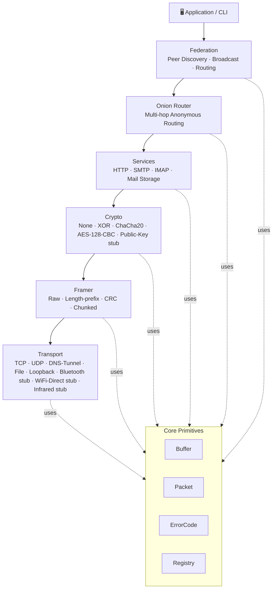
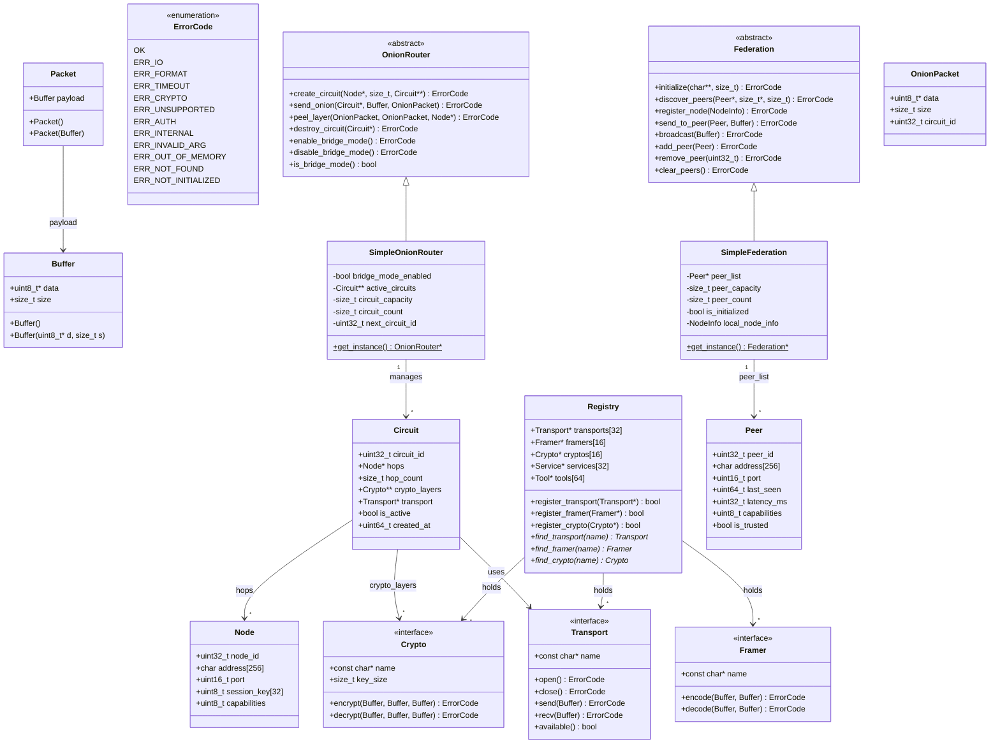
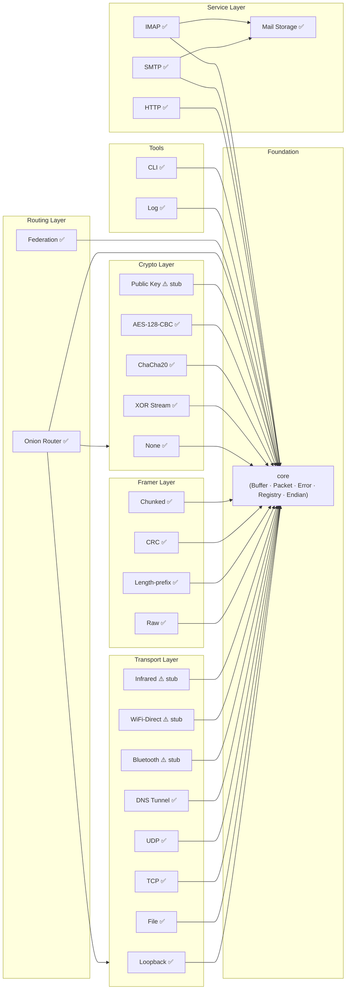
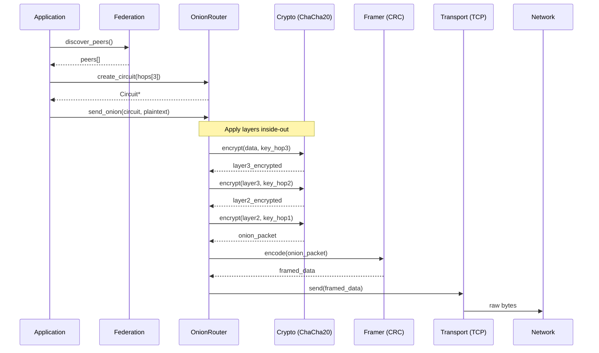
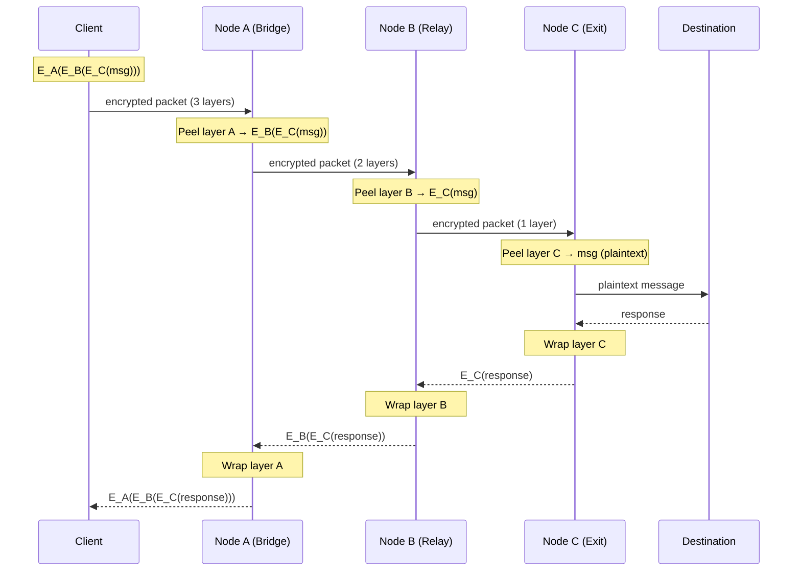
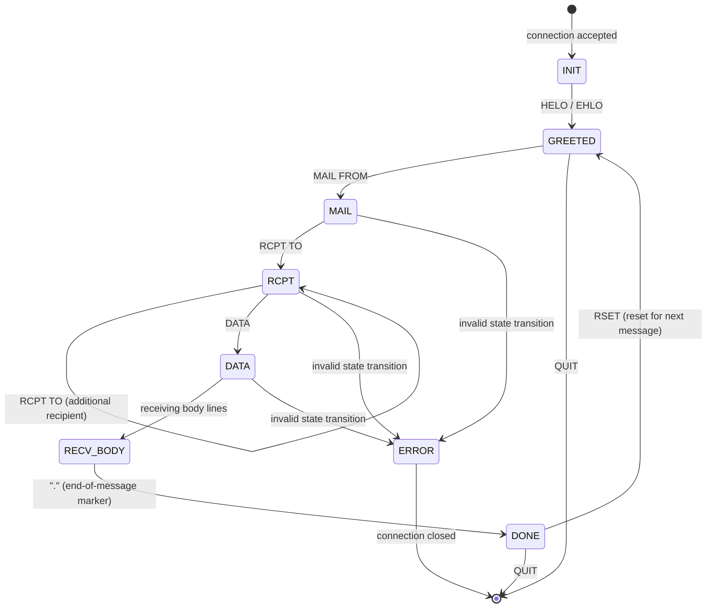
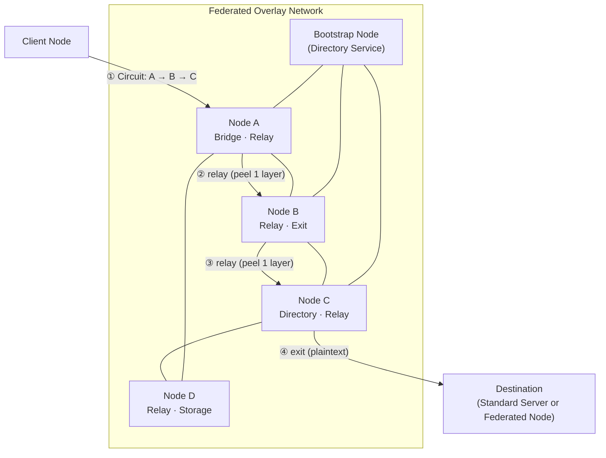

# FEDERATED — Universal Resilient Communication Toolkit

**Language:** C++17 (zero external dependencies)  
**Methodology:** Test-First, Flat Design, Explicit Ownership  
**Target:** Resilient communications under normal, degraded, or censored networks

---

## Overview

Federated is a **universal, resilient communication toolkit** designed to operate across **any available medium** — digital, analog, or human-assisted — while remaining auditable, extensible, and survivable.

### Key Features

* Communication during partial or total internet shutdowns
* Acts as a standard internet server when connectivity exists
* Multi-modal operation: P2P, Share-It-style, or classic web service
* Optional cryptography, onion routing, and federation
* Built-in diagnostics, monitoring, feed aggregation, and CLI/Web/TUI interfaces
* Scriptable, automatable, and observable behavior
* Interoperable with standard RFC-compliant servers (web, email, DNS)

---

## Building

```bash
mkdir build
cd build
cmake ..
make
```

## Running Tests

```bash
./federated_tests
```

Or with CMake:

```bash
ctest
```

---

## Quick Start

### Start HTTP Server
```bash
# Build the project first
./build/federated

# The HTTP server can be started programmatically or via CLI
# Example: Serve static files from a directory
# (Full CLI integration coming in Phase 4)
```

### Use TCP Transport
```cpp
#include "federated/transport/tcp.h"
#include "federated/core/buffer.h"

using namespace federated;

// Get TCP transport instance
transport::Transport* tcp = transport::TCPTransport::get_instance();

// Open connection (creates loopback server for testing)
tcp->open();

// Send data
const char* msg = "Hello, TCP!";
core::Buffer send_buf(
    const_cast<uint8_t*>(reinterpret_cast<const uint8_t*>(msg)),
    strlen(msg)
);
tcp->send(send_buf);

// Receive data
uint8_t recv_data[1024];
core::Buffer recv_buf(recv_data, sizeof(recv_data));
tcp->recv(recv_buf);

// Close connection
tcp->close();
```

### Use ChaCha20 Encryption
```cpp
#include "federated/crypto/chacha20.h"
#include "federated/core/buffer.h"

using namespace federated;

// Get ChaCha20 instance
crypto::Crypto* chacha = crypto::ChaCha20Crypto::get_instance();

// Prepare key (32 bytes) + nonce (12 bytes)
uint8_t key_data[44];
// ... fill with key and nonce ...
core::Buffer key(key_data, 44);

// Encrypt
const char* plaintext = "Secret message";
core::Buffer plain_buf(
    const_cast<uint8_t*>(reinterpret_cast<const uint8_t*>(plaintext)),
    strlen(plaintext)
);

uint8_t cipher_data[1024];
core::Buffer cipher_buf(cipher_data, sizeof(cipher_data));

chacha->encrypt(plain_buf, key, cipher_buf);

// Decrypt (symmetric)
uint8_t decrypted_data[1024];
core::Buffer decrypted_buf(decrypted_data, sizeof(decrypted_data));

chacha->decrypt(cipher_buf, key, decrypted_buf);
```

### Use CRC Framing
```cpp
#include "federated/framer/crc.h"
#include "federated/core/buffer.h"

using namespace federated;

// Get CRC framer
framer::Framer* crc = framer::CRCFramer::get_instance();

// Encode with CRC checksum
const char* data = "Important data";
core::Buffer input(
    const_cast<uint8_t*>(reinterpret_cast<const uint8_t*>(data)),
    strlen(data)
);

uint8_t frame_data[1024];
core::Buffer frame_buf(frame_data, sizeof(frame_data));

crc->encode(input, frame_buf);

// Decode and verify
uint8_t decoded_data[1024];
core::Buffer decoded_buf(decoded_data, sizeof(decoded_data));

core::ErrorCode err = crc->decode(frame_buf, decoded_buf);
if (err == core::OK) {
    // CRC valid, data intact
} else {
    // CRC failed, data corrupted
}
```

### Use Onion Routing for Anonymous Communication
```cpp
#include "federated/onion/onion.h"
#include "federated/federation/federation.h"
#include "federated/core/buffer.h"

using namespace federated;

// Get onion router and federation instances
onion::OnionRouter* router = onion::SimpleOnionRouter::get_instance();
federation::Federation* fed = federation::SimpleFederation::get_instance();

// Initialize federation with bootstrap nodes
const char* bootstrap[] = {
    "192.168.1.10:9050",
    "192.168.1.11:9050",
    "192.168.1.12:9050"
};
fed->initialize(bootstrap, 3);

// Discover peers in the network
federation::Peer peers[10];
size_t peer_count = 0;
fed->discover_peers(peers, &peer_count, 10);

// Select 3 nodes for onion circuit
onion::Node hops[3];
for (size_t i = 0; i < 3; i++) {
    hops[i].node_id = peers[i].peer_id;
    strcpy(hops[i].address, peers[i].address);
    hops[i].port = peers[i].port;
    hops[i].capabilities = onion::NODE_CAPABILITY_RELAY;
    
    // Set session keys (in production, these would be negotiated)
    memcpy(hops[i].session_key, /* key data */, 32);
}

// Create onion circuit
onion::Circuit* circuit = nullptr;
router->create_circuit(hops, 3, &circuit);

// Send secret message through circuit with layered encryption
const char* secret = "Secret message";
core::Buffer plaintext(
    const_cast<uint8_t*>(reinterpret_cast<const uint8_t*>(secret)),
    strlen(secret)
);

onion::OnionPacket packet;
router->send_onion(circuit, plaintext, packet);

// Message now encrypted in 3 layers - intermediate nodes cannot see plaintext

// Clean up
router->destroy_circuit(circuit);
```

### Use Federation Protocol
```cpp
#include "federated/federation/federation.h"

using namespace federated;

// Get federation instance
federation::Federation* fed = federation::SimpleFederation::get_instance();

// Register this node
federation::NodeInfo info;
strcpy(info.address, "192.168.1.100");
info.port = 9050;
info.capabilities = federation::PEER_CAPABILITY_RELAY | 
                   federation::PEER_CAPABILITY_BRIDGE;
strcpy(info.version, "0.1.0");
fed->register_node(info);

// Add peers manually
federation::Peer peer;
peer.peer_id = 42;
strcpy(peer.address, "192.168.1.50");
peer.port = 9050;
peer.capabilities = federation::PEER_CAPABILITY_RELAY;
fed->add_peer(peer);

// Send message to specific peer
const char* msg = "Hello, peer!";
core::Buffer message(
    const_cast<uint8_t*>(reinterpret_cast<const uint8_t*>(msg)),
    strlen(msg)
);
fed->send_to_peer(peer, message);

// Broadcast to all peers
fed->broadcast(message);
```

---

## Architecture



All layers are independent, modular, and testable.

---

## UML Diagrams

### Class Diagram



---

### Module Dependency Graph



---

### End-to-End Data Flow



---

### Onion Routing: Circuit Traversal



---

### SMTP Protocol State Machine



---

### Federated Network Topology



---

## Project Structure

```
include/federated/   # Public headers
  core/              # Core primitives (Buffer, Packet, Registry, Error)
  transport/         # Transport layer (TCP, UDP, DNS, File, Loopback, etc.)
  framer/            # Frame encoding/decoding (Raw, Length-prefix, CRC, Chunked)
  crypto/            # Cryptography (None, XOR, ChaCha20, Public-key stub)
  onion/             # Onion routing (multi-hop circuits, bridge mode)
  federation/        # Federation protocol (peer discovery, messaging)
  service/           # Services (HTTP, SMTP, IMAP, Mail Storage)
  tool/              # Diagnostics and utilities
    diag/            # ping, arp, netstat, ifconfig, route (planned)
    feed/            # RSS/JSON feed aggregation (planned)
    monitor/         # Agent-less monitoring (planned)
    cli/             # CLI interface

src/                 # Implementation (mirrors include)
tests/               # Test suite (mirrors src)
examples/            # Example applications
docs/                # Documentation
```

---

## Design Principles

1. **Flat architecture** — no deep inheritance, no hidden control flows
2. **Zero external runtime dependencies** — only libc and OS syscalls
3. **Test-first development** — every feature starts with a failing test
4. **Explicit state and ownership** — no hidden allocations, all errors returned explicitly
5. **Transport and protocol agnostic** — analog, digital, or hybrid channels
6. **Survivable by design** — operates in censorship, blackouts, or infrastructure collapse
7. **Interoperable** — peers may be standard RFC-compliant servers

---

## Development Status

**Last Updated:** 2026-02-08

### Current Implementation

#### ✅ Phase 1: Foundation (100% Complete)

**Core Primitives**
- Buffer, Packet, Error, Registry, Endian

**Transport Layer** (82% - 9 of 11 with stubs, 45% fully functional)
- ✅ FULL: Loopback, File, TCP (RFC 793), UDP (RFC 768), DNS Tunnel (RFC 1035)
- ⚠️ STUB: Bluetooth, WiFi Direct, Infrared (require platform APIs)
- ⏳ Planned: Audio, QR, FM Radio

**Framer Layer** (100% - 4 of 4)
- ✅ Raw, Length-prefix, CRC, Chunked

**Crypto Layer** (67% - 4 of 6 implemented)
- ✅ FULL: None, XOR Stream, ChaCha20 (RFC 8439), **AES-128-CBC (NIST FIPS 197)**
- ⚠️ STUB: Public Key/RSA (requires big integer library)
- ⏳ Planned: AES-256, Advanced methods

**Services**
- ✅ HTTP Server (RFC 9110/9112) - 16 tests
- ✅ SMTP Protocol (RFC 5321) - 8 tests + E2E
- ✅ IMAP Protocol (RFC 3501) - 9 tests + E2E
- ✅ Mail Storage System - 6 tests

**Tools**
- ✅ Log System (5 levels, colors, drivers)
- ✅ CLI Framework (command/service registration, signals)

#### ✅ Phase 2 & 3: Essential Features (COMPLETED)

All essential transports (TCP, UDP, DNS Tunnel), framers (CRC, Chunked), crypto (ChaCha20), and services (HTTP, SMTP, IMAP) implemented with comprehensive tests.

#### 🔄 Phase 4: Advanced Features and Platform Integration (In Progress - Q1 2026)

**High Priority:**
- ✅ **AES Encryption** (NIST FIPS 197, CBC mode) - **COMPLETED**
- ✅ **DNS Tunnel Rate Limiting** - Anti-detection features **COMPLETE** 🆕
- 🔴 Bluetooth Transport (Linux with BlueZ, Windows with Winsock2)

**Medium Priority:**
- 🔴 WiFi Direct Transport (Linux with wpa_supplicant)
- 🔴 Infrared Transport (IrDA over serial ports)

**Documentation:**
- ✅ Complete: Phase 4 Roadmap, Platform Abstraction Guide, TODO Tracking

See `docs/PHASE4_ROADMAP.md` for detailed implementation plan.

#### ✅ Phase 5: Onion Routing and Federation (COMPLETED - Q1 2026)

**Onion Routing Layer:**
- ✅ Multi-hop circuit construction with configurable hop count (1-10 hops)
- ✅ Layered encryption using ChaCha20 for each hop
- ✅ Bridge/relay mode support for nodes
- ✅ Circuit lifecycle management (create, send, destroy)
- ✅ Full anonymity: intermediate nodes cannot see plaintext

**Federation Protocol:**
- ✅ Peer discovery and registration
- ✅ Bootstrap node support
- ✅ Peer capability tracking (relay, bridge, exit, directory, storage)
- ✅ Message routing (unicast and broadcast)
- ✅ Graceful handling of missing/offline peers

**Integration:**
- ✅ 4 comprehensive end-to-end scenarios
- ✅ 26 new tests added (all passing)
- ✅ Full integration with existing transport, framer, and crypto layers

See `docs/PHASE5_ROADMAP.md` for detailed implementation plan.

#### ⏳ Phase 6+: Future Enhancements (Planned)

- Advanced transports (Audio, QR, FM Radio)
- Public key cryptography (RSA/ECC - requires architecture decision)
- Full CLI/TUI/Web interfaces
- Performance benchmarking and optimization
- Advanced onion routing features (circuit pooling, traffic analysis resistance)

### Test Coverage

- **198 tests** (171 unit + 27 scenario), **1051 assertions**
- **100% code coverage** maintained
- E2E shell tests for SMTP, IMAP
- Build time: <15s, Test runtime: <1s
- Zero warnings, zero security alerts

### Documentation

- ✅ Complete: `docs/rfc_references.md`, `docs/test_plan.md`, `docs/architecture.md`, `docs/STATUS.md`
- ✅ Complete: `docs/PHASE4_ROADMAP.md`, `docs/PHASE5_ROADMAP.md`, `docs/PLATFORM_ABSTRACTION.md`, `docs/TODO_TRACKING.md`
- See `docs/` for detailed specifications

### Next Priorities

1. **Phase 4 Features** (Advanced crypto and platform-specific transports)
   - AES Implementation (NIST FIPS 197) - 3-5 days
   - DNS Tunnel Enhancement (rate limiting, Base32) - 4-6 days
   - Bluetooth Transport (Linux first) - 5-7 days
   - Platform Abstraction Layer (cross-platform support)

2. **Phase 6 Features** (Advanced routing and transports)
   - Circuit pooling and optimization
   - Traffic analysis resistance
   - Audio, QR, FM Radio transports
   - Full CLI/TUI/Web interfaces

For detailed roadmap and task tracking:
- **Implementation Plan**: `docs/PHASE4_ROADMAP.md`
- **TODO Tracking**: `docs/TODO_TRACKING.md`
- **Implementation Plan**: `docs/PHASE4_ROADMAP.md`, `docs/PHASE5_ROADMAP.md`
- **TODO Tracking**: `docs/TODO_TRACKING.md`
- **Platform Guide**: `docs/PLATFORM_ABSTRACTION.md`
- **AI Agent Guidelines**: `.github/agents/copilot-instructions.md`

---

## License

MIT License - See LICENSE file for details.
